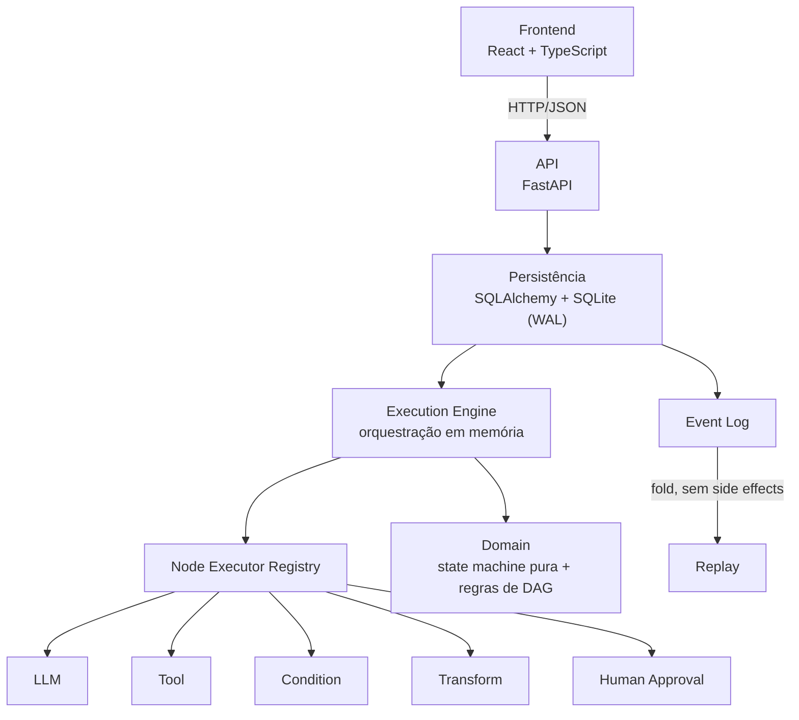
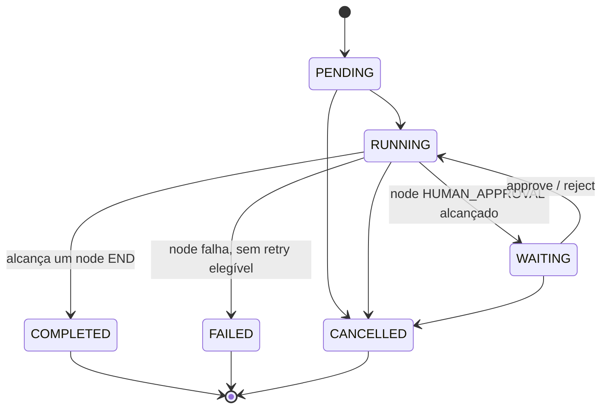
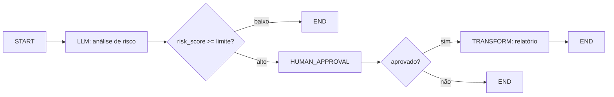
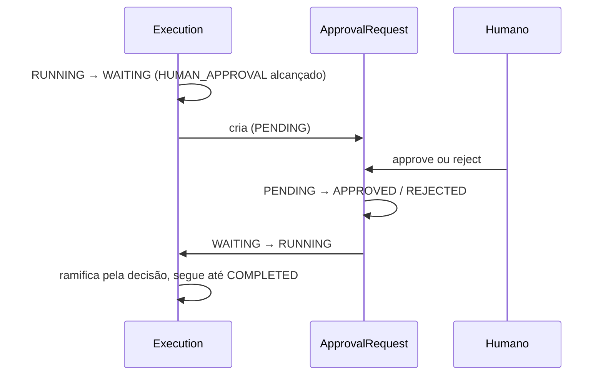

<h1 align="center">AI Workflow Engine</h1>

<p align="center">
  Um motor de orquestração de workflows durável e com intervenção humana (human-in-the-loop)
  para aplicações de IA — branching, persistência, recovery, retry, replay e observabilidade,
  construído e testado de ponta a ponta.
</p>

<p align="center">
  
  
  
  
  
  
  
</p>

---

## Por quê?

Chamar um LLM é os 10% fáceis. Um *workflow* — o que realmente vai pra produção — precisa de mais do que uma chamada de modelo:

- **branching** sobre o que o modelo decidiu;
- **retry** só no passo que falhou de forma transitória, sem repetir os que já deram certo;
- **persistência** de estado, pra uma queda no meio da execução não perder nem corromper nada;
- **pausar pra um humano** quando a decisão é importante demais pra automatizar, e retomar exatamente de onde parou — horas ou dias depois;
- **recuperação** automática quando o processo que estava rodando morre;
- **observabilidade** real do que aconteceu, a partir de um log de eventos durável — não de `print()` espalhado pelo código.

Este projeto é uma implementação pequena, feita do zero, dessa camada. Não é um chatbot, não é uma biblioteca de prompts, não é uma demo que só funciona no caminho feliz — é um motor de orquestração onde a chamada de LLM é um tipo de node entre sete, não o ponto central do exercício.

## Funcionalidades

**Workflow**
- Validação de grafo DAG-only (sem ciclos, sem edges soltas, sem branching implícito) — aplicada antes de qualquer execução
- Um registry de node executors — o Engine nunca decide por `if node.type == ...`
- Uma DSL de condição pequena, fechada e livre de `eval` para branching (`{"field": ..., "operator": ..., "value": ...}`)
- Uma state machine formal para `Execution` e `NodeExecution` — transição ilegal levanta erro, não acontece silenciosamente

**IA**
- Abstração `LLMProvider` — o Engine e a API dependem do protocolo, nunca de um SDK concreto
- `MockLLMProvider` — totalmente offline, determinístico, usado em todos os testes e na demo padrão
- `OpenAIProvider` e `AnthropicProvider` — providers reais via HTTP (`httpx`), isolados atrás da mesma interface
- Node types `LLM` e `TOOL`, além de `START`/`END`/`CONDITION`/`TRANSFORM`/`HUMAN_APPROVAL`

**Confiabilidade**
- Persistência em SQLite (modo WAL), uma transação por chamada de API
- Recovery de crash: uma varredura baseada em heartbeat encontra nodes travados em `RUNNING` e marca como `FAILED` — como um registro novo, nunca mutando o histórico
- Retry orientado a política (backoff fixo/exponencial, tentativas limitadas, filtrado por categoria de erro), com chave de idempotência estável por tentativa
- Concorrência otimista (CAS) em `Execution` e `ApprovalRequest` — quem perde a corrida recebe um conflito, nunca uma sobrescrita silenciosa

**Human-in-the-loop**
- Um node `HUMAN_APPROVAL` suspende a execução em `WAITING` e cria um `ApprovalRequest` durável
- `approve`/`reject` retomam a execução pelas mesmas precondições de domínio que um chamador direto usaria
- Rejeição é um resultado de negócio no qual o workflow pode ramificar, nunca uma falha automática

**Observabilidade**
- Um catálogo de eventos completo e monotônico por execução (`execution_started`, `node_completed`, `condition_evaluated`, `approval_approved`, ...)
- `replay()` reconstrói o estado da execução só a partir desse log de eventos — nunca chama LLM, tool ou banco
- Campos de payload com formato de segredo são redigidos antes de qualquer evento sair da API

**API**
- FastAPI, com injeção de dependência (sem singleton global de engine/banco), suporte a `Idempotency-Key` nos endpoints que alteram estado
- Mapeamento uniforme de erros — nunca vaza stack trace ou exceção crua
- Schema OpenAPI completo em `/docs`

**Frontend**
- SPA em React + TypeScript: canvas do workflow, status de execução ao vivo, UI de aprovação, timeline de eventos, tela de replay
- Fala com a API real via HTTP — nenhum caminho de dados mockado dentro do próprio app

## Arquitetura



As dependências apontam só para baixo — `domain` não importa nada deste projeto, `engine` importa só `domain`, `persistence` importa `domain`+`engine`, `api` importa os três. Isso é garantido por convenção e checado na suíte de testes, não só descrito aqui. Detalhamento completo, com o fluxo de cada requisição, em [`docs/architecture.md`](docs/architecture.md); o modelo de domínio completo e a semântica de confiabilidade (escritos *antes* do código) estão em [`DESIGN.md`](DESIGN.md).

## Ciclo de vida da execução



Cada seta é uma transição que a state machine do domínio permite explicitamente (`domain/state_machine.py`) — qualquer outra levanta `InvalidStateTransitionError`. Uma falha de node com retry elegível não aparece como seta de topo: o Engine tenta de novo de forma síncrona, dentro do `RUNNING`, antes de tocar em `Execution.state`.

## Demo

O workflow que este projeto foi construído para demonstrar:



1. Uma execução começa; o node `LLM` chama o provider configurado (mock, OpenAI ou Anthropic).
2. Um node `CONDITION` avalia a saída do modelo contra um limite.
3. Risco baixo termina imediatamente.
4. Risco alto chega em `HUMAN_APPROVAL` — a execução suspende em `WAITING` e um `ApprovalRequest` durável é criado.
5. Um humano aprova ou rejeita (pela API ou pelo painel de aprovação do frontend).
6. A execução retoma, ramifica de novo com base na decisão, e completa.
7. Cada passo acima gerou um evento; `GET /executions/{id}/events` retorna o log completo e ordenado.
8. `GET /executions/{id}/replay` reconstrói o mesmo estado final só a partir desse log — sem chamar LLM ou tool nenhuma.

Roda você mesmo, totalmente offline, agora:

```bash
python -m workflow_engine.demo
```

Isso constrói e executa exatamente esse workflow contra um SQLite temporário usando `MockLLMProvider`, imprimindo cada evento conforme acontece, resolvendo a aprovação automaticamente, e terminando ao dar replay no log e confirmar que bate com a execução ao vivo.

> **Screenshots**: este README não embute imagens de screenshot — o ambiente onde este projeto foi feito não tem como salvar uma captura de tela do navegador como arquivo committável. Os fluxos acima (canvas, `WAITING` com o painel de aprovação, `COMPLETED`, a timeline de eventos e o replay) foram todos rodados ao vivo contra uma instância real e verificados visualmente durante o desenvolvimento; a pasta `docs/images/` está pronta para receber capturas reais (veja [Quick start](#quick-start) — reproduzir leva menos de dois minutos).

## Quick start

Requer Python 3.11+ e Node 20+.

```bash
# Backend
pip install -e ".[dev]"
uvicorn workflow_engine.api:create_app --factory --reload
# → API:     http://localhost:8000
# → Swagger: http://localhost:8000/docs
```

```bash
# Frontend (em outro terminal)
cd frontend
npm install
npm run dev
# → http://localhost:5173  (repassa /api para localhost:8000 — ver vite.config.ts)
```

Nenhuma configuração é necessária pra nenhum dos dois — a API usa `LLM_PROVIDER=mock` por padrão e um arquivo SQLite local `workflow_engine.db`. Abre o frontend, clica em **Load demo workflow** e depois **Start execution**.

## Configuração

Copia `.env.example` para `.env` e ajusta — o `pydantic-settings` lê automaticamente. Nenhuma dessas variáveis tem um valor secreto como padrão.

| Variável | Padrão | Observação |
|---|---|---|
| `DATABASE_URL` | `workflow_engine.db` | Um nome de arquivo, ou `:memory:` pra um banco efêmero |
| `LLM_PROVIDER` | `mock` | `mock` \| `openai` \| `anthropic` |
| `OPENAI_API_KEY` | *(nenhum)* | Só necessário se `LLM_PROVIDER=openai` |
| `OPENAI_MODEL` | `gpt-4o-mini` | |
| `ANTHROPIC_API_KEY` | *(nenhum)* | Só necessário se `LLM_PROVIDER=anthropic` |
| `ANTHROPIC_MODEL` | `claude-sonnet-5` | |
| `LOG_LEVEL` | `INFO` | |
| `ENVIRONMENT` | `development` | `development` \| `test` \| `production` |
| `MAX_REQUEST_BODY_BYTES` | `1000000` | Requisições acima disso recebem `413` |
| `CORS_ALLOW_ORIGINS` | `[]` (fechado) | Precisa ser habilitado explicitamente — nunca `["*"]` |

A API se recusa a iniciar com `LLM_PROVIDER=openai`/`anthropic` sem a chave correspondente configurada — nunca cai pro mock silenciosamente.

### Modo offline

`LLM_PROVIDER=mock` (o padrão) não precisa de credencial, rede nem configuração nenhuma. O `MockLLMProvider` é determinístico — dado o mesmo mapeamento configurado de prompt/resposta, sempre devolve a mesma coisa — e é isso que permite a suíte de testes inteira, o script de demo e o pipeline de CI rodarem sem nenhuma dependência externa. Todo teste deste repositório roda assim; nenhum faz chamada de rede real.

## API

Documentação interativa completa em `/docs` (OpenAPI/Swagger). Resumo:

| Método | Endpoint | Descrição |
|---|---|---|
| `GET` | `/health` | Health check |
| `POST` | `/workflows` | Registra uma definição de workflow |
| `GET` | `/workflows/{workflow_id}` | Busca uma definição de workflow |
| `POST` | `/executions` | Inicia uma nova execução |
| `GET` | `/executions/{execution_id}` | Busca o estado atual de uma execução |
| `POST` | `/executions/{execution_id}/approve` | Aprova uma decisão HITL pendente |
| `POST` | `/executions/{execution_id}/reject` | Rejeita uma decisão HITL pendente |
| `GET` | `/executions/{execution_id}/events` | Histórico completo de eventos |
| `GET` | `/executions/{execution_id}/replay` | Reconstrói o estado a partir do log de eventos |

`POST /executions`, `.../approve` e `.../reject` aceitam um header opcional `Idempotency-Key` — uma requisição repetida com a mesma chave repete a primeira resposta em vez de rodar a operação de novo.

## Confiabilidade

- **Persistência**: cada chamada do `PersistentExecutionEngine` (`start`/`run`/`resume`) é exatamente uma transação SQL — a `Execution` (CAS), cada `NodeExecution`, cada `Event` e o `ApprovalRequest` daquela chamada, tudo ou nada.
- **Recovery**: ao reiniciar, uma varredura baseada em heartbeat encontra `Execution`s travadas em `RUNNING` cujo `NodeExecution` mais recente está rodando há mais tempo que o timeout, e marca essa tentativa como `FAILED(TRANSIENT)` — como um registro **novo**, o original nunca é mutado.
- **Retry**: síncrono, dentro do loop do Engine, limitado por `RetryPolicy.max_attempts`, filtrado por `ErrorCategory`.
- **Idempotência**: uma chave estável por tentativa lógica; um header `Idempotency-Key` nas chamadas de API que alteram estado, para deduplicação em nível de requisição.
- **Concorrência**: otimista — `UPDATE ... WHERE version = ?` em `Execution`/`ApprovalRequest`; quem perde a corrida recebe 409, nunca uma sobrescrita silenciosa.

**Isso não garante exactly-once execution.** A garantia real é at-least-once para efeitos colaterais de node, exactly-once para transições de estado persistidas (via CAS). Ver [`DESIGN.md` §17](DESIGN.md#17-reliability-semantics-fases-59-consolidado) para o detalhamento completo — dez perguntas concretas sobre falhas, respondidas concretamente, sem passar por cima.

### Replay

`GET /executions/{id}/replay` reconstrói `variables`, `trigger_input`, histórico de nodes e o estado inferido, só a partir do log de eventos persistido.

O replay **não**:
- chama um LLM;
- executa uma tool;
- faz nenhuma requisição HTTP;
- dispara nenhum efeito colateral.

Verificado por um teste baseado em AST que inspeciona os imports de `engine/replay.py` — não só um comentário prometendo isso. **Replay ≠ rerun**: ele mostra o que aconteceu; não faz de novo.

## Human-in-the-loop



Rejeição é um resultado de negócio, não uma falha técnica — quem escreve o workflow coloca um node `CONDITION` normal depois da aprovação pra decidir aonde "rejeitado" leva; o Engine nunca força `FAILED` por conta própria. Aprovar/rejeitar uma requisição já resolvida, uma execução que não está em `WAITING`, ou uma aprovação que não pertence ao node em que a execução está esperando de fato, tudo isso falha com um 409 claro — validado pelas mesmas precondições de domínio que um chamador direto em processo enfrentaria, não só uma checagem da camada de API.

## Testes

Os números abaixo são de uma execução fresca contra este código exato, não uma alegação histórica.

**Backend** — 362 testes passando, 99% de cobertura de linhas, `ruff` e `mypy --strict` limpos:

```bash
pytest --cov=workflow_engine --cov-report=term-missing
ruff check src tests
mypy
```

**Frontend** — 20 testes passando, lint/typecheck/build todos limpos:

```bash
cd frontend
npm run lint
npm run typecheck
npm run test
npm run build
```

**Avaliação baseada em cenários** (diferente da suíte pytest — checagens em linguagem simples dos invariantes centrais do engine: execução linear, branching, falha, retry, HITL, recovery, replay, rejeição de resume duplicado):

```bash
python -m evals.run
```

## Segurança

- DSL de condição: conjunto fechado de operadores sobre dados estruturados — nunca `eval`/`exec`, verificado por inspeção de AST nos testes.
- Tools: input estruturado (`{"op": "add", "a": 1, "b": 2}`) — sem parser de expressão em string, sem superfície de injeção.
- Nenhum segredo hardcoded em nenhum lugar do código; chaves de API são lidas só do ambiente, nunca logadas, nunca incluídas numa mensagem de erro.
- SQL é parametrizado em todo lugar (SQLAlchemy Core) — nenhuma concatenação de string em query em lugar nenhum.
- Erros da API têm formato fixo `{"detail": "..."}` — nenhum stack trace, SQL ou exceção interna chega ao cliente; exceções inesperadas são logadas no servidor e retornadas como 500 genérico.
- Payloads de evento são redigidos de chaves com formato de segredo (`api_key`, `password`, `*_token`, `authorization`, ...) antes de saírem da API.
- Tamanho do corpo da requisição é limitado (413 acima de um limite configurável); CORS é fechado por padrão e precisa ser habilitado explicitamente.
- Replay é isolado por construção — não consegue alcançar um provider, uma tool ou a rede mesmo que tentasse (ver [Replay](#replay)).

## Limitações

- **Sem scheduler real**: retry é síncrono dentro de uma chamada do Engine; nada respeita `next_retry_at` em tempo real de verdade.
- **Sem prevenção de corrida de aprovação entre processos além do CAS**: a guarda em memória do Engine contra dupla resolução é por processo; a garantia durável é o CAS persistido.
- **SQLite, single-writer** — uma escolha deliberada da V1 (ver `DESIGN.md`), não um atalho; um deployment real com múltiplos escritores precisaria de Postgres.
- **Sem deduplicação de retry de ponta a ponta**: a chave de idempotência dá a *interface* pra um provider/tool real deduplicar; nem o `MockLLMProvider` nem as tools embutidas têm estado externo pra deduplicar contra.
- **O frontend é uma demo técnica focada**, não uma interface de produção polida — um conjunto pequeno de componentes e um layout de grafo simples e nivelado, não um layout genérico.
- **Sem endpoint ou evento de cancelamento**: `ExecutionEngine.cancel()` existe e é testado, mas não está conectado à API, e não emite um evento `EXECUTION_CANCELLED` mesmo no nível do engine.
- **Build do Docker não verificado** no ambiente onde este projeto foi feito (Docker não estava disponível ali) — as imagens seguem padrões usuais mas não foram testadas de fato.

## Próximos passos (não implementados)

- Um scheduler real em background pra retry/timeout.
- Suporte a PostgreSQL pra deployments com múltiplos escritores.
- Um endpoint de cancelamento na API e seu evento.
- Construções de loop no grafo do workflow (V1 é DAG-only).
- Workers distribuídos, se uma necessidade real de escala algum dia justificasse.
- Uma revisão de design de verdade no frontend.
- Providers de LLM adicionais.

Nada da lista acima está implementado — está listado aqui pra deixar explícito que ficar de fora foi decisão, não esquecimento.

## Estrutura do projeto

```
src/workflow_engine/
  domain/        modelo de domínio puro + state machine — zero I/O
  engine/        engine de orquestração em memória, registry de nodes, providers
  persistence/   camada de durabilidade SQLAlchemy/SQLite, recovery
  api/           camada REST em FastAPI
  demo.py        script de demo offline de ponta a ponta
frontend/        SPA em React + TypeScript
evals/           script de avaliação baseado em cenários
tests/           suíte de testes do backend
docs/            documentação de arquitetura
DESIGN.md        o documento de design completo, escrito antes da implementação
```

## Princípios de design

- **Isolamento de domínio** — a camada de domínio pura não tem nenhum import fora dela mesma e da standard library; checado por um teste baseado em AST, não só por uma docstring.
- **Inversão de dependência** — o Engine depende dos protocolos `LLMProvider`/`Tool`, nunca de um SDK concreto; a API depende do Engine, nunca o contrário.
- **Modelos de domínio imutáveis** — todo objeto de domínio é congelado (frozen); uma "mudança" retorna uma instância nova, nunca uma mutação.
- **Transições de estado explícitas** — uma state machine, um lugar só, checada antes de toda transição; nada vira outro estado implicitamente.
- **Testes determinísticos** — providers/tools mockados e clocks injetáveis tornam a suíte inteira reproduzível sem acesso à rede.
- **Replay sem efeitos colaterais** — reconstrução e reexecução são operações diferentes, e o código garante que continuem diferentes.
- **Semântica de falha honesta** — nenhuma alegação de "exactly-once", nenhum scheduler escondido, nenhuma exceção engolida silenciosamente; toda lacuna acima está documentada, não foi descoberta depois.

## Licença

Nenhum arquivo de licença está incluído. Até que um seja adicionado, todos os direitos são reservados ao autor — este repositório é para fins de portfólio/demonstração.

## Autor

Leonardo Teixeira
